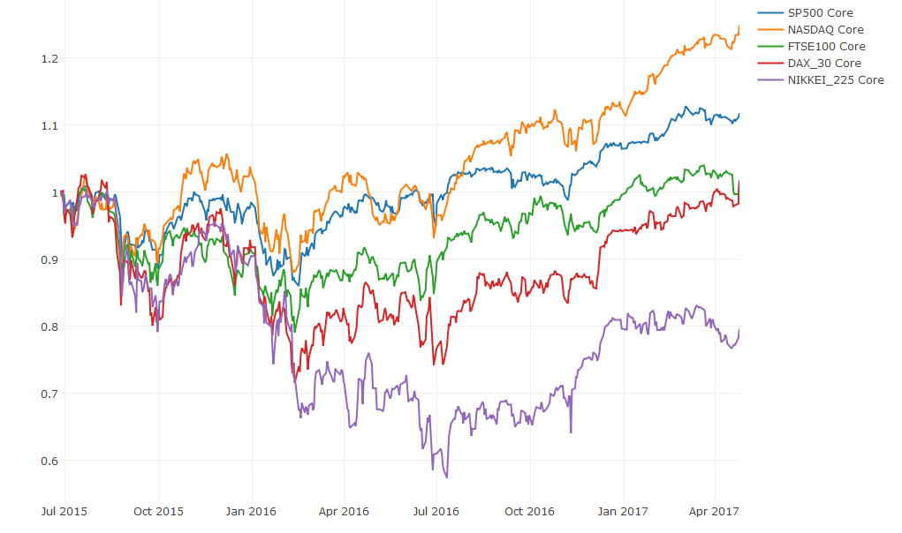

[](http://quantlet.de/)

## [](http://quantlet.de/) **CRIXcoreWealth** [](http://quantlet.de/)

```yaml

Name of Quantlet : CRIXcoreWealth

Published in : Portfolio Optimization with crypto-currencies

Description : 'Cumulative return of the different cores with an initial investment of 1 dollar'

Keywords : tedas, core, cumulative return, cryptocurrency,

Author : SIVAGOUROU Dinesh

Submitted : 2018/08/24

Datafile :
- cryptos data
- core : SP500, FTSE100, NASDAQ, DAX30, NIKKEI225 

Output :
- Plot of the cumulative return of the diffenrent cores .
- SP500
- FTSE100
- NASDAQ
- DAX30
- NIKKEI225
```



### R Code
```r

# clear all variables
rm(list = ls(all = TRUE))
graphics.off()

# install and load packages
libraries = c( "plotly")
lapply(libraries, function(x) if (!(x %in% installed.packages())) {
  install.packages(x)
})
lapply(libraries, library, quietly = TRUE, character.only = TRUE)


##### Cumulative return for the Core


Wealth_CORE_SP500  = cumsum(c(1,SP500[window_length:(length(SP500))]))
Wealth_CORE_SP500  = Wealth_CORE_SP500[-length(Wealth_CORE_SP500)]

Wealth_CORE_NASDAQ  = cumsum(c(1,NASDAQ[window_length:(length(NASDAQ))]))
Wealth_CORE_NASDAQ  = Wealth_CORE_NASDAQ[-length(Wealth_CORE_NASDAQ)]

Wealth_CORE_FTSE100  = cumsum(c(1,FTSE100[window_length:(length(FTSE100))]))
Wealth_CORE_FTSE100  = Wealth_CORE_FTSE100[-length(Wealth_CORE_FTSE100)]

Wealth_CORE_DAX_30  = cumsum(c(1,DAX_30_PERFORMANCE[window_length:(length(DAX_30_PERFORMANCE))]))
Wealth_CORE_DAX_30  = Wealth_CORE_DAX_30[- length(Wealth_CORE_DAX_30_PERFORMANCE) ]

Wealth_CORE_NIKKEI_225   = cumsum(c(1,NIKKEI_225[window_length:(length(NIKKEI_225))]))
Wealth_CORE_NIKKEI_225   = Wealth_CORE_NIKKEI_225[-length(Wealth_CORE_NIKKEI_225 )]


###### Plot 

plot_ly(x = Core$date[window_length: length(Core$date)]) %>%
  add_lines(y = Wealth_CORE_NIKKEI_225[1 : (length(Core$date)-window_length+1) ], name = "Core",mode="lines",line = list(color = 'rgb(0, 0, 0)'))%>%
  add_lines(y = Wealth_NAIVE_NIKKEI_225[1 :( length(Core$date)-window_length+1 )], name = "Wealth_NAIVE",line = list(mode = "lines"))%>%
  add_lines(y = Wealth_HYBRID_NIKKEI_225[1 :( length(Core$date)-window_length+1 )], name = "Wealth_HYBRID",line = list(mode = "lines"))%>%
  add_lines(y = Wealth_HYBRID_MV_NIKKEI_225[1 :( length(Core$date)-window_length+1 )], name = "Wealth_HYBRID_MV",line = list(mode = "lines"))%>%
  add_lines(y = Wealth_RISK_WEIGHTED_NIKKEI_225[1 :( length(Core$date)-window_length+1 )], name = "Wealth_RISK_WEIGHTED",line = list(mode = "lines",color = 'rgb(0, 0, 255)'))%>%
  layout(title = paste("Cumulative return for",tochar(NIKKEI_225), "with window length=",as.character(window_length),sep=" "))

```

automatically created on 2018-09-04