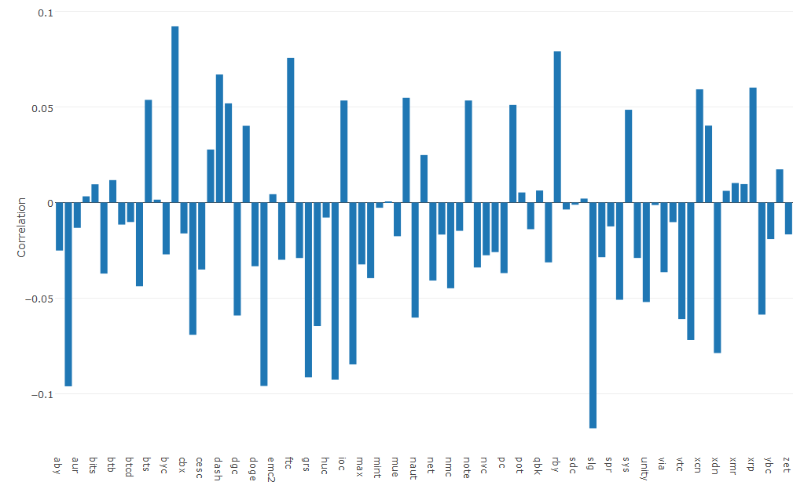
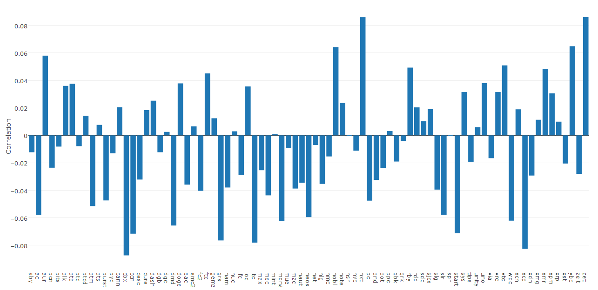
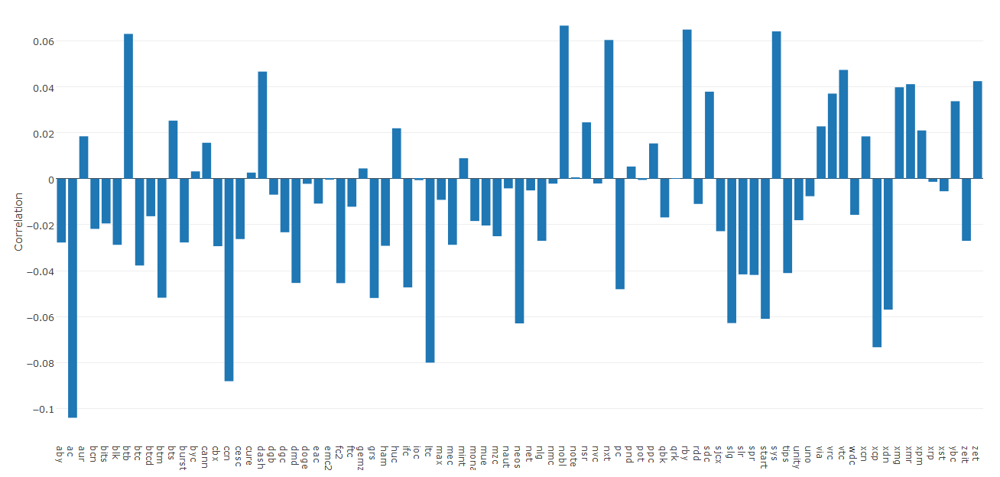
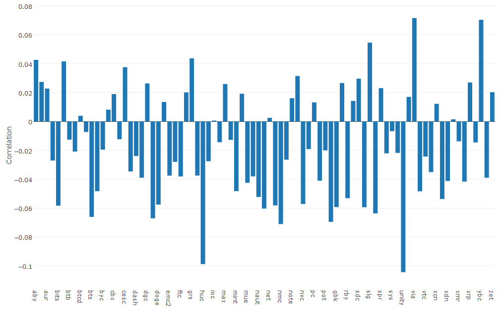

[](http://quantlet.de/)

## [](http://quantlet.de/) **CRIXtedasCorrelationCoreCryptos** [](http://quantlet.de/)

```yaml

Name of Quantlet : CRIXtedasCorrelationCoreCryptos

Published in : Portfolio Optimization with crypto-currencies

Description : 'Plots the Correlation of an index, here CORE, against crypto currencies'

Keywords : tedas, correlation, portfolio, cryptos, cryptocurrency

Author : SIVAGOUROU Dinesh

Submitted : 2018/08/24

Datafile :
- cryptos data
- core : SP500, FTSE100, NASDAQ, DAX30, NIKKEI225 

Output :
- Plot of correlation of Core agains cryptos.
- SP500
- FTSE100
- NASDAQ
- DAX30
- NIKKEI225

```










### R Code
```r

library(plotly)


### Correlation cryptos with core ###

corr_core_cryptos = cor(SP500,data_cryptos)
corr_core_cryptos = cor(NASDAQ_COMPUTER,data_cryptos)
corr_core_cryptos = cor(FTSE_100,data_cryptos)
corr_core_cryptos = cor(DAX_30_PERFORMANCE,data_cryptos)
corr_core_cryptos = cor(NIKKEI_225,data_cryptos)


plot_ly(x=colnames(corr_core_cryptos),y=as.numeric(corr_core_cryptos[1,])) %>%
  layout(title = "Correlation bewtween SP500",yaxis=list(title="Correlation"))


#### Normality Test ####


a= matrix(rep(0,2*83),ncol=83)
colnames(a)=colnames(data_cryptos_84_sp500)
rownames(a)=c("Shapiro Statisitc","p-value")


for (i in 1 : 83){
  
  u=shapiro.test(data_cryptos_84_sp500[,i])
  
  a[1,i]=u$statistic
  a[2,i]=u$p.value
  
  
}

a=data.frame(a)
a=t(a)

write.csv2(a,"normality_test_cryptos.csv")


```

automatically created on 2018-09-04